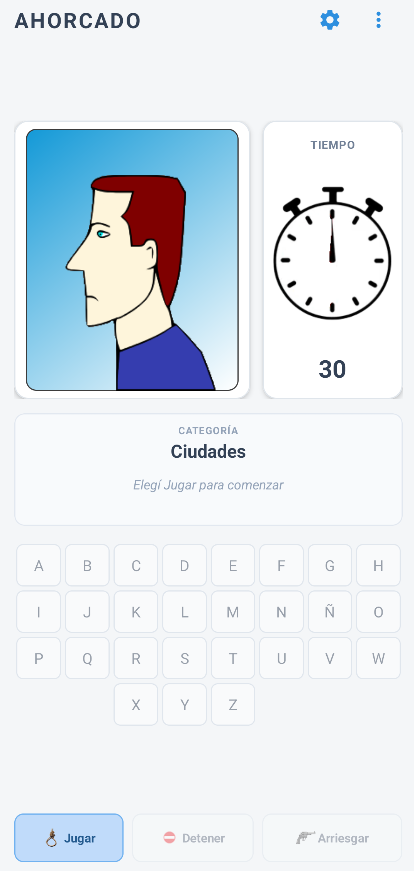
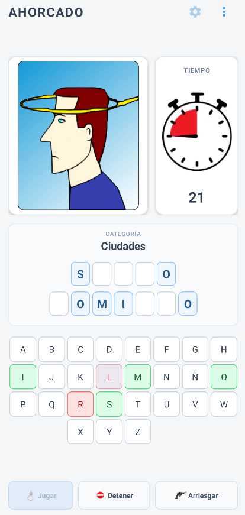
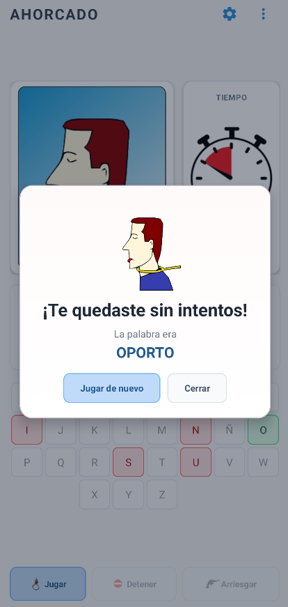

# Ahorcado para Android

**Ahorcado** es una versión moderna para Android del juego que desarrollé originalmente en **Turbo Pascal para Windows en 1996**.

Casi 30 años después, el proyecto vuelve como una aplicación móvil nativa, manteniendo la idea y la identidad del juego original pero con una interfaz adaptada a teléfonos y tablets actuales.

## Características

- Juego clásico del ahorcado con interfaz moderna.
- Aplicación nativa para Android desarrollada en **Java + XML**.
- Interfaz adaptable a teléfonos y tablets, en orientación vertical y horizontal.
- Disponible en **Español e Inglés**.
- Selección automática del idioma del dispositivo y cambio manual desde Preferencias.
- Categorías incluidas:
  - Países
  - Ciudades
  - Marcas de autos
  - Bandas de rock
- Más de **1.000 palabras y expresiones** entre ambos idiomas.
- Temporizador configurable: **15, 30, 45 o 60 segundos**.
- Opción para arriesgar la palabra completa.
- Efectos de sonido para aciertos, errores, victoria y derrota.
- Pantallas integradas de ayuda, preferencias y acerca de.
- Funciona completamente **offline**.
- Sin anuncios.
- Sin registro ni cuenta de usuario.
- Sin permisos especiales.

## Capturas

  
  
  

## Idiomas

Ahorcado incluye soporte completo para:

- Español
- English

Si el idioma del dispositivo no es Español, la aplicación utiliza Inglés como idioma predeterminado.

## Compatibilidad

- Android 6.0 (API 23) o superior.
- Optimizado para teléfonos y tablets.
- Diseño adaptable según el ancho y la altura disponibles.

## Estado del proyecto

**Versión actual: 1.0.0**

La aplicación se encuentra finalizada y preparada para su publicación en Google Play.

[Página oficial de Ahorcado](https://llorieb.github.io/AhorcadoMovil/)

## Privacidad

Ahorcado no recopila datos personales, no utiliza cuentas de usuario, publicidad ni servicios de analítica.

[Política de privacidad](https://llorieb.github.io/AhorcadoMovil/privacy-policy.html)

## Desarrollo

El proyecto está desarrollado con:

- Java
- Android SDK
- Material Components
- Gradle

El juego utiliza una arquitectura sencilla y completamente local. Las palabras se almacenan dentro de los recursos de la aplicación y no se requiere conexión a Internet durante el juego.

## Historia

La primera versión de Ahorcado fue creada en **1996** utilizando Turbo Pascal para Windows.

Esta versión Android nació como una reinterpretación del proyecto original, conservando su mecánica clásica pero reconstruyendo completamente la interfaz y la arquitectura para dispositivos actuales.

---

**Ahorcado © 1996–2026**
